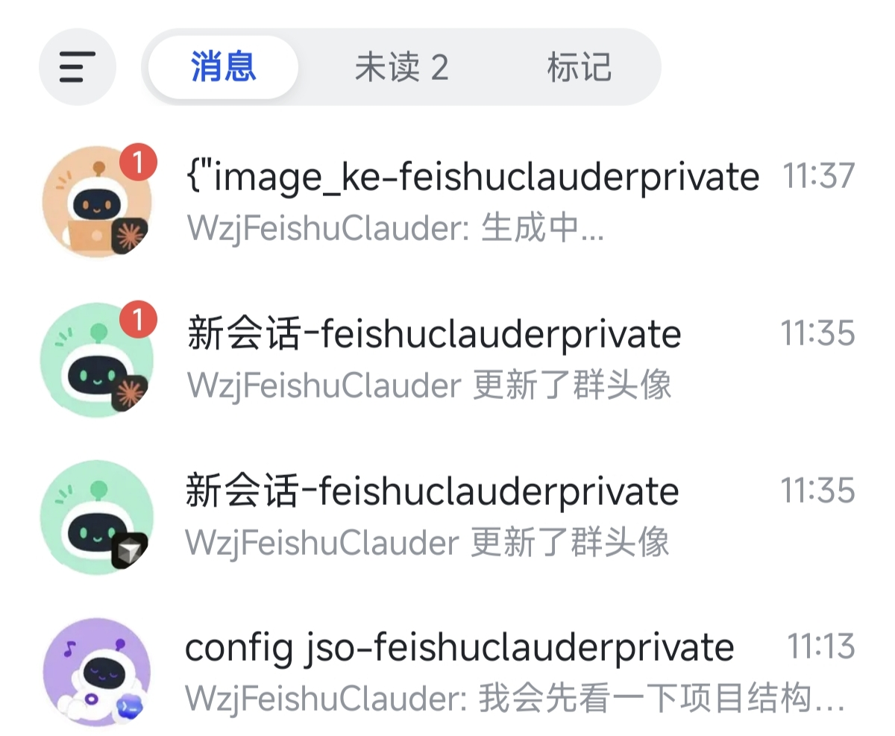
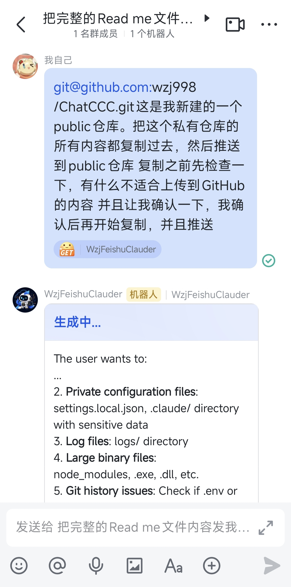
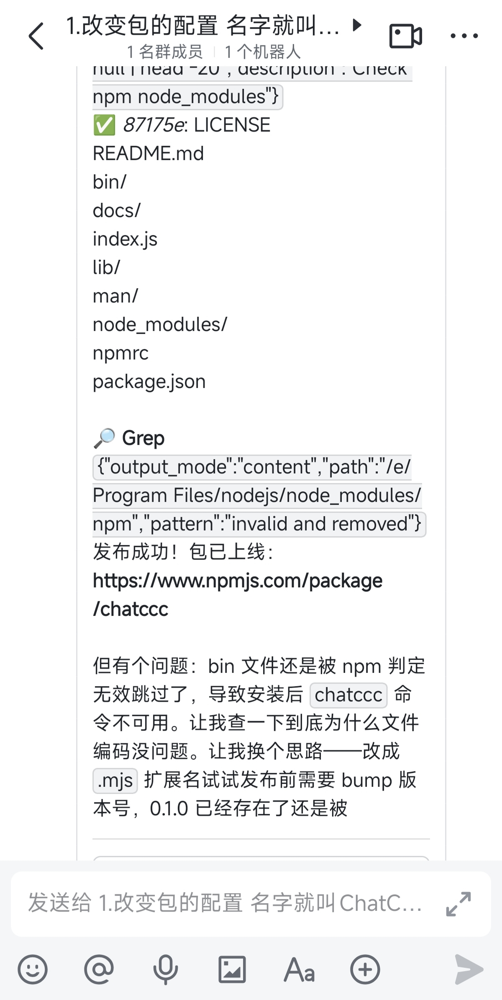
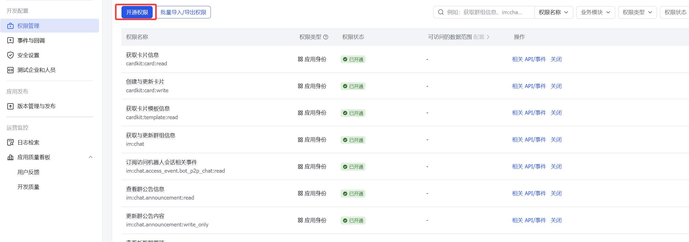
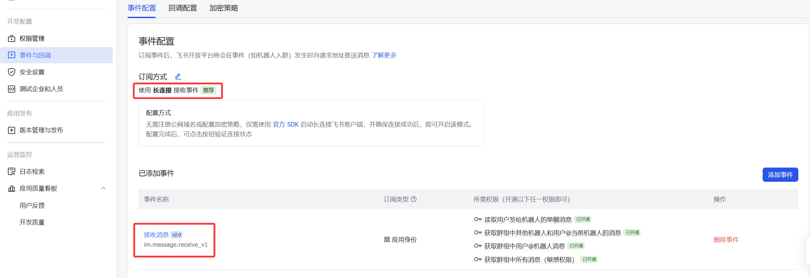
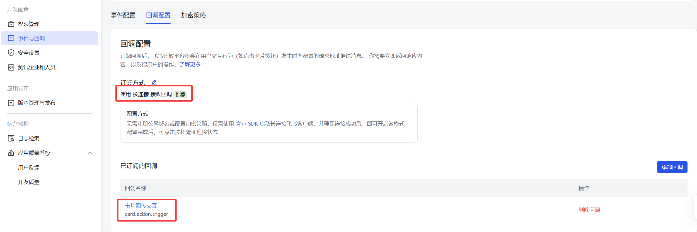

# ChatCCC

**用飞书或微信聊天控制 Claude Code / Cursor / Codex。**

ChatCCC 把本地 AI 编程工具接入即时通讯软件。你可以在手机上发消息，让 Claude Code、Cursor Agent 或 Codex 继续写代码、查问题、跑命令；不用一直守在电脑前。

飞书是推荐入口：群聊就是会话，卡片能流式更新，体验完整。微信 iLink 更适合快速试用或临时使用：扫码即可接入，但只能走私聊文本模式。

<p align="center">
  
  &nbsp;
  
  &nbsp;
  
</p>

---

## 为什么用 ChatCCC

- **手机上也能用 AI 编程工具**：在飞书或微信发消息，就像在终端给 Agent 下指令。
- **飞书体验更完整**：一群一会话、CardKit 卡片流式更新、支持群管理和多会话并行。
- **微信接入更轻**：不用创建飞书应用，启动后扫码即可在微信私聊里使用。
- **多 Agent 切换**：`/new` 使用默认 Agent，也可以用 `/new claude`、`/new cursor`、`/new codex` 指定工具。
- **群里能跑 git**：`/git status`、`/git pull`、`/git log` 会在当前会话工作目录执行，并把输出发回聊天窗口。

## 飞书和微信的差异

| 项目 | 飞书（推荐） | 微信 iLink |
| --- | --- | --- |
| 使用场景 | 长期主力使用 | 快速试用、临时远程控制 |
| 会话形态 | 群聊，一群一会话 | 私聊，一对一 |
| 消息展示 | CardKit 卡片，流式更新 | 纯文本，增量推送 |
| `/new` | 自动创建新群并绑定新会话 | 在当前私聊里创建新会话 |
| 多会话并行 | 直接切换不同群 | 支持并行，使用切换指令后未完成的任务会继续在后台进行，但不如飞书直观方便 |
| 群管理 | 支持创建、重命名、解散、头像 | 不支持 |
| 接入成本 | 需要配置飞书应用 | 启动后扫码登录 |

如果你主要在手机上长期控制 AI 编程工具，优先用飞书；如果只是想马上跑起来，微信更省配置。

---

## 怎么部署

### 1. 安装

#### Windows 一键安装（零依赖起步）

如果你的电脑没有装任何东西，**复制下面全部内容，打开 PowerShell 粘贴，回车**。脚本会自动检测并安装所有缺失的依赖，最后启动 ChatCCC。全程只需确认一次 UAC 弹窗。

```powershell
# ============================================================
# ChatCCC Windows 一键安装脚本
# 用法: 复制全部内容 → 打开 PowerShell → 粘贴 → 回车
# 优先用 winget（快），没有则直接下载安装包（零依赖）
# ============================================================

# --- 辅助函数：安装完程序后刷新 PATH，让当前窗口立即可用 ---
function Refresh-Path {
    $env:Path = [System.Environment]::GetEnvironmentVariable('Path','Machine') + ';' + [System.Environment]::GetEnvironmentVariable('Path','User')
}

# --- 辅助函数：判断一个命令是否已安装 ---
function Test-Cmd($name) { return [bool](Get-Command $name -ErrorAction SilentlyContinue) }

# --- 判断 winget 是否可用 ---
$useWinget = Test-Cmd winget

Write-Host ''
Write-Host '============================================================' -ForegroundColor Cyan
Write-Host '  ChatCCC 环境检测与一键安装' -ForegroundColor Cyan
if ($useWinget) {
    Write-Host '  安装方式: winget（Windows 包管理器）' -ForegroundColor DarkGray
} else {
    Write-Host '  安装方式: 直接下载（无需 winget）' -ForegroundColor DarkGray
}
Write-Host '============================================================' -ForegroundColor Cyan
Write-Host ''

# ============================================================
# [1/2] 安装 Node.js（ChatCCC 运行环境，要求 >= 20）
# ============================================================
if (Test-Cmd node) {
    Write-Host "[1/2] Node.js 已安装: $(node --version 2>$null)" -ForegroundColor Green
} else {
    Write-Host '[1/2] Node.js 未安装，正在安装...' -ForegroundColor Yellow
    
    if ($useWinget) {
        # 方式 A：winget 安装（推荐，速度快）
        Write-Host '        （如弹出 UAC 窗口请点击"是"）' -ForegroundColor DarkGray
        winget install OpenJS.NodeJS.LTS --accept-source-agreements --accept-package-agreements
    } else {
        # 方式 B：直接请求 Node.js 官网目录页，从页面中提取最新 LTS 安装包链接
        Write-Host '        正在获取最新 LTS 版本...' -ForegroundColor DarkGray
        # 请求 latest-v22.x 目录页（返回该大版本下最新的小版本列表）
        $dirHtml = (Invoke-WebRequest 'https://nodejs.org/dist/latest-v22.x/' -UseBasicParsing).Content
        # 从 HTML 中匹配 MSI 文件名，如 node-v22.15.0-x64.msi
        $msiFile = [regex]::Match($dirHtml, 'node-v\d+\.\d+\.\d+-x64\.msi').Value
        if (-not $msiFile) {
            Write-Host '        错误: 未能从页面中提取 MSI 下载链接' -ForegroundColor Red
            exit 1
        }
        Write-Host "        正在下载 $msiFile ..." -ForegroundColor DarkGray
        # 用提取到的文件名拼出完整下载链接
        $nodeMsi = "$env:TEMP\$msiFile"
        Invoke-WebRequest "https://nodejs.org/dist/latest-v22.x/$msiFile" -OutFile $nodeMsi
        Write-Host '        正在静默安装（请稍候）...' -ForegroundColor DarkGray
        # /quiet 静默安装，/norestart 不自动重启
        Start-Process msiexec.exe -ArgumentList "/i `"$nodeMsi`" /quiet /norestart" -Wait
        Remove-Item $nodeMsi -Force
    }
    
    Refresh-Path
    Write-Host "[1/2] Node.js 安装完成: $(node --version 2>$null)" -ForegroundColor Green
}

# ============================================================
# [2/2] 安装 ChatCCC 本体（npm 全局安装）
# ============================================================
Write-Host '[2/2] 正在从 npm 安装 ChatCCC...' -ForegroundColor Yellow
npm install -g chatccc
Write-Host '[2/2] ChatCCC 安装完成！' -ForegroundColor Green

# ============================================================
# 启动 ChatCCC（首次启动自动打开浏览器进入配置向导）
# ============================================================
Write-Host ''
Write-Host '============================================================' -ForegroundColor Cyan
Write-Host '  环境就绪，正在启动 ChatCCC ...' -ForegroundColor Cyan
Write-Host '  浏览器将自动打开 Web 配置页面' -ForegroundColor Cyan
Write-Host '============================================================' -ForegroundColor Cyan
Write-Host ''
chatccc
```

如果一切顺利，浏览器会自动打开 `http://127.0.0.1:18080` 的 Web 配置页面。按页面提示填入飞书 App ID / App Secret，点击"保存并启动"即可。

> **只想装 ChatCCC 本体？** 如果你已经有 Node.js，直接 `npm install -g chatccc && chatccc` 即可，不需要跑上面的完整脚本。

#### 其他安装方式

```bash
npm install -g chatccc
chatccc
```

要求 Node.js >= 20。安装完成后，在任意目录执行 `chatccc` 即可启动。配置、日志和状态文件会保存在用户目录的 `.chatccc` 下：

- Windows：`C:\Users\<用户名>\.chatccc\`
- macOS / Linux：`~/.chatccc/`

旧版本留在仓库或包目录下的 `config.json`、`logs/`、`state/` 会在首次启动时自动迁移到用户目录。

首次启动时，如果还没有有效配置，ChatCCC 会自动打开本地 Web 配置向导（默认 `http://127.0.0.1:18080`）。

#### 从源码运行

```bash
git clone https://github.com/wzj998/ChatCCC.git
cd ChatCCC
npm install
npm run dev
```

### 2. 即时通讯软件配置

#### 飞书（推荐）

1. 打开 [飞书开放平台](https://open.feishu.cn)，创建一个**企业自建应用**。
2. 在「应用功能」里开启**机器人**能力。
3. 在「权限管理」里开通 `im:` 和 `cardkit:` 前缀下的相关权限：

| 前缀 | 用途 |
| --- | --- |
| `im:` | 收发消息、创建和管理群聊、机器人发言 |
| `cardkit:` | 卡片展示、流式更新、按钮和交互回调 |

<p align="center">
  
</p>

4. 在「事件与回调」里订阅 `im.message.receive_v1` 和 `card.action.trigger`。

<p align="center">
  
  &emsp;
  
</p>

5. 创建应用版本并发布（企业内部可用即可）。
6. 在「凭证与基础信息」复制 **App ID** 和 **App Secret**，填入本地 Web 配置向导或 `config.json`。

如果你同时使用公司飞书和个人飞书，建议把个人账号放在另一个客户端里：安卓可用系统「应用双开」，iOS 可用 Lark。

#### 微信 iLink（可选）

微信模式不需要创建飞书应用。保持 `config.json` 里的 `platforms.ilink.enabled` 为 `true`（默认开启），启动 `chatccc` 后，终端会打印微信扫码登录二维码。

```bash
chatccc
# 控制台出现二维码后，用微信扫一扫登录
# 在微信里找到机器人，发送 /new 开始对话
```

微信登录信息会保存到 `~/.chatccc/state/ilink-auth.json`。token 过期后重新扫码即可。

### 3. AI 工具配置

ChatCCC 只负责把聊天消息转给本地 AI 工具，不捆绑这些 CLI。你只需要安装自己要用的 Agent。

#### Claude Code

本机完成 Claude Code 登录后即可使用。ChatCCC 通过 Anthropic Claude Agent SDK 调用 Claude Code 能力，同时支持官方和第三方 Anthropic 兼容 API：使用官方服务无需额外配置，使用第三方 API 则填写 `claude.apiKey` 和 `claude.baseUrl`。`claude.model`、`claude.subagentModel`、`claude.effort`、`claude.apiKey`、`claude.baseUrl` 均为选填；`claude.maxTurn` 控制每次对话的最大轮数（默认 0，即无限制）。填写后会把对应配置传给 Claude Agent SDK；留空则以 `~/.claude/settings.json` 为准。

#### Cursor Agent CLI

Windows 推荐安装：

```powershell
irm 'https://cursor.com/install?win32=true' | iex
agent login
```

验证：

```bash
agent --version
```

#### Codex CLI

```bash
npm install -g @openai/codex
codex login
codex --version
```

Codex 的默认模型和推理强度可继续由 `~/.codex/config.toml` 管理，也可以在 `config.json` 中覆盖。

### 4. `config.json`

`~/.chatccc/config.json` 不存在时，ChatCCC 会从 `config.sample.json` 复制一份。常用结构如下：

```json
{
  "feishu": {
    "appId": "cli_xxxxxxxxxxxx",
    "appSecret": "xxxxxxxxxxxxxxxxxxxxxxxxxx"
  },
  "platforms": {
    "feishu": { "enabled": true, "platformType": "feishu" },
    "ilink": { "enabled": true, "reuseTokenOnStart": true }
  },
  "port": 18080,
  "gitTimeoutSeconds": 180,
  "allowInterrupt": false,
  "claude": {
    "enabled": false,
    "defaultAgent": true,
    "model": "claude-sonnet-4-6",
    "subagentModel": "",
    "effort": "",
    "apiKey": "",
    "baseUrl": "",
    "maxTurn": 0
  },
  "cursor": {
    "enabled": false,
    "defaultAgent": false,
    "path": "",
    "model": "",
    "avatarBatteryMode": "apiPercent",
    "onDemandMonthlyBudget": 1000
  },
  "codex": {
    "enabled": false,
    "defaultAgent": false,
    "path": "",
    "model": "",
    "effort": ""
  }
}
```

| 字段 | 说明 |
| --- | --- |
| `feishu.appId` / `feishu.appSecret` | 飞书应用凭证 |
| `platforms.feishu.enabled` | 是否启用飞书 |
| `platforms.feishu.platformType` | 飞书平台类型，默认 `feishu` |
| `platforms.ilink.enabled` | 是否启用微信 iLink |
| `platforms.ilink.reuseTokenOnStart` | 启动时是否复用已有微信登录 token |
| `port` | 本地 Web 配置面板和中继服务端口 |
| `gitTimeoutSeconds` | `/git` 命令超时时间，默认 180 秒 |
| `allowInterrupt` | 是否允许新消息中断正在运行的任务；默认 false |
| `*.enabled` | 是否启用对应 AI Agent |
| `*.defaultAgent` | `/new` 未指定 Agent 时使用哪个工具 |
| `cursor.path` / `codex.path` | CLI 可执行文件路径；留空时自动探测或使用 PATH |
| `cursor.avatarBatteryMode` | Cursor 头像电量显示来源：`apiPercent` 或 `onDemandUse` |
| `cursor.onDemandMonthlyBudget` | `avatarBatteryMode=onDemandUse` 时用于计算电量的月预算 |
| `claude.model` / `claude.subagentModel` / `claude.effort` | 选填；设置后传给 Claude Agent SDK，留空以 `~/.claude/settings.json` 为准 |
| `claude.apiKey` / `claude.baseUrl` | 选填；设置后传给 Claude Agent SDK，留空以 `~/.claude/settings.json` 为准 |
| `claude.maxTurn` | 选填；Claude 最大对话轮数，默认 0（无限制），可在 Web UI 编辑 |

> **权限控制**：普通消息以 `bypassPermissions` 模式运行，跳过 Agent 操作确认。使用 `/plan` 或 `/ask` 前缀时，ChatCCC 自动切换为只读模式：Claude SDK 仅放行 Read + stop-stuck-loop 网络请求，Codex 使用 `--sandbox read-only`，Cursor 使用 `--mode plan/ask`。请只在可信环境中使用。

### 5. 开始使用

**飞书：** 找到你的机器人，发送 `/new`、`/new claude`、`/new cursor` 或 `/new codex`。机器人会创建一个新群并绑定 AI 会话，之后直接在群里聊天即可。

**微信：** 扫码登录后，在机器人私聊里发送 `/new` 或指定 Agent 的 `/new ...` 命令即可开始。功能与飞书基本一致，但展示为纯文本。

## 可用指令

| 指令 | 作用 |
| --- | --- |
| `/new` | 使用默认 Agent 创建新会话 |
| `/new claude` | 创建 Claude Code 会话 |
| `/new cursor` | 创建 Cursor 会话 |
| `/new codex` | 创建 Codex 会话 |
| `/newh` | 重置当前会话，保留工作目录 |
| `/model` | 查看或切换当前会话的模型 |
| `/stop` | 停止当前回复 |
| `/cancel` | 取消当前会话里排队等待处理的消息 |
| `/state` | 查看当前会话状态 |
| `/cd` | 查看或设置当前会话工作目录 |
| `/sessions` | 查看所有会话状态 |
| `/session <数字>` | 将当前群聊切换到 `/sessions` 列表中的指定会话 |
| `/usage` | 查看当前会话对应 Agent 的用量；Codex 显示 5h/周用量，Cursor 显示当前周期用量 |
| `/git <子命令>` | 在当前会话工作目录执行 `git ...` 并回传输出 |
| `/abd<内容>` | 去掉 `/abd` 前缀后把内容发给 Agent，并在消息末尾追加第一性原理需求澄清提示 |
| `/plan <内容>` | 只读计划模式：仅允许读文件和 stop-stuck-loop 请求，不执行任何写操作 |
| `/ask <内容>` | 只读问答模式：与 /plan 相同，仅允许读文件和 stop-stuck-loop 请求 |
| `/restart` | 重启机器人进程 |
| `/update` | 更新 npm 全局包并重启（仅限 `npm install -g chatccc` 安装的全局进程） |
| `/deleteg` | 解散当前飞书会话群；Agent 会话记录保留 |

> **模型切换**：`/model` 查看当前会话 Agent 的可选模型清单，`/model <名称>` 模糊匹配切换，`/model clear` 恢复默认。可选模型来自当前 Agent 的配置：Claude 使用 `claude.model` / `claude.subagentModel`，Cursor 使用 `cursor.model`，Codex 使用 `codex.model`。

---

## 技术栈

TypeScript / Node.js >= 20 / tsx / Anthropic Claude Agent SDK / Cursor Agent CLI / Codex CLI / 飞书 WebSocket API / CardKit / 微信 iLink
