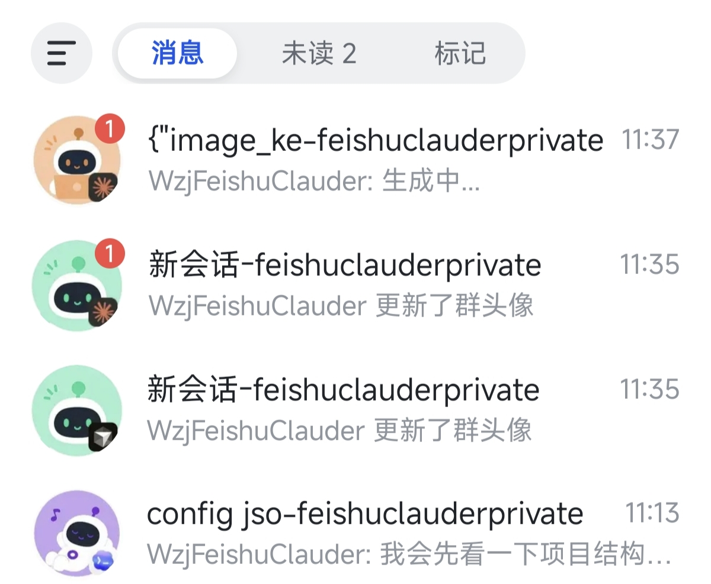
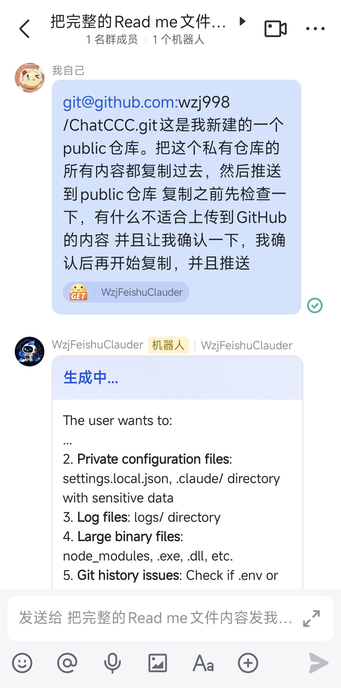
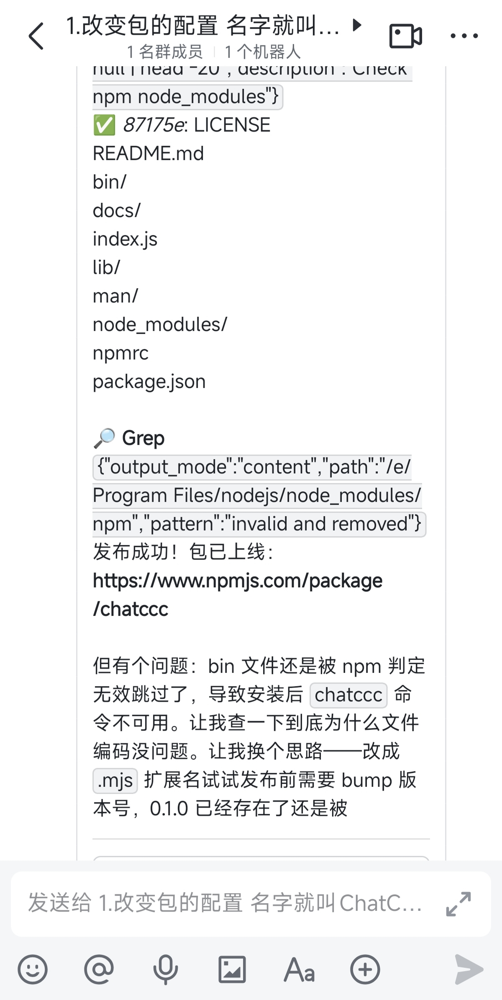
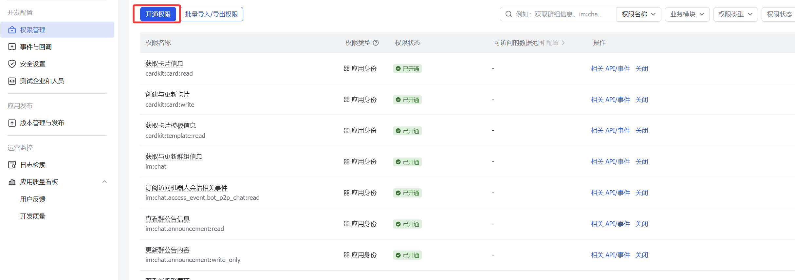
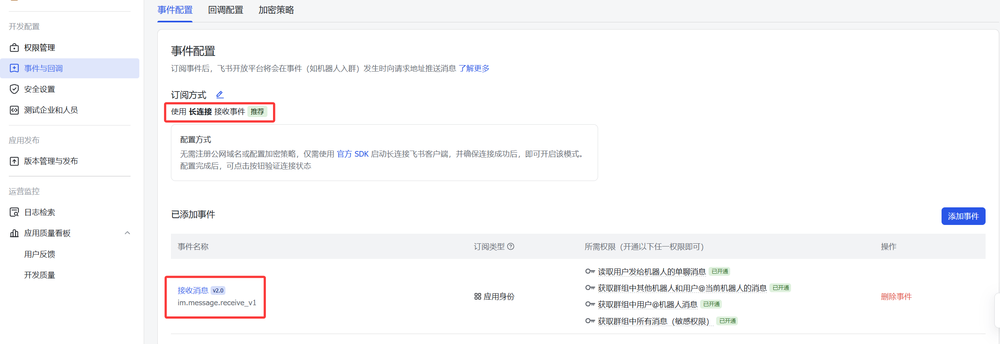
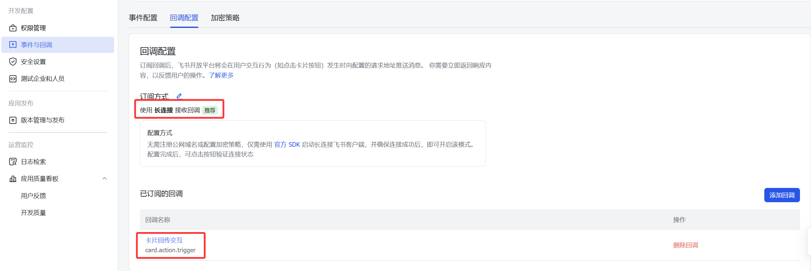

# ChatCCC

**用飞书或微信聊天控制 Claude Code / Cursor / Codex / CCC Agent / DeepSeek Harness。**

ChatCCC 把本地 AI 编程工具接入即时通讯软件。你可以在手机上发消息，让 Claude Code、Cursor Agent、Codex、内置 CCC Agent 或 DeepSeek Harness 继续写代码、查问题、跑命令；不用一直守在电脑前。

飞书是推荐入口：直接私聊机器人即可持续使用同一个专属会话，需要并行任务时再用 `/new` 创建独立会话群；卡片能流式更新，体验完整。微信 iLink 更适合快速试用或临时使用：扫码即可接入，但只能走私聊文本模式。

<p align="center">
  
  &nbsp;
  
  &nbsp;
  
</p>

---

## 为什么用 ChatCCC

- **手机上也能用 AI 编程工具**：在飞书或微信发消息，就像在终端给 Agent 下指令。
- **飞书体验更完整**：私聊可持续对话，`/new` 创建的一群一会话支持多任务并行，CardKit 卡片可流式更新。
- **微信接入更轻**：不用创建飞书应用，启动后扫码即可在微信私聊里使用。
- **多 Agent 切换**：`/new` 使用默认 Agent，也可以用 `/new claude`、`/new cursor`、`/new codex`、`/new ccc`、`/new dsh` 指定工具。
- **群里能跑 git**：`/git status`、`/git pull`、`/git log` 会在当前会话工作目录执行，并把输出发回聊天窗口。

## 飞书和微信的差异

| 项目 | 飞书（推荐） | 微信 iLink |
| --- | --- | --- |
| 使用场景 | 长期主力使用 | 快速试用、临时远程控制 |
| 会话形态 | 私聊固定专属会话；`/new` 创建一群一会话 | 私聊，一对一 |
| 消息展示 | CardKit 卡片，流式更新 | 纯文本，增量推送 |
| `/new` | 自动创建新群并绑定新会话 | 在当前私聊里创建新会话 |
| 多会话并行 | 直接切换不同群 | 支持并行，使用切换指令后未完成的任务会继续在后台进行，但不如飞书直观方便 |
| 群管理 | 支持创建、重命名、解散、头像 | 不支持 |
| 接入成本 | 需要配置飞书应用 | 启动后扫码登录 |

如果你主要在手机上长期控制 AI 编程工具，优先用飞书；如果只是想马上跑起来，微信更省配置。

---

## 怎么部署

### 1. 安装

#### Windows 一键安装（零依赖起步）

如果你的电脑没有装任何东西，**复制下面全部内容，打开 PowerShell 粘贴，回车**。脚本会自动检测并安装所有缺失的依赖，最后启动 ChatCCC。全程只需确认一次 UAC 弹窗。

```powershell
# ============================================================
# ChatCCC Windows 一键安装脚本
# 用法: 复制全部内容 → 打开 PowerShell → 粘贴 → 回车
# 优先用 winget（快），没有则直接下载安装包（零依赖）
# ============================================================

# --- 辅助函数：安装完程序后刷新 PATH，让当前窗口立即可用 ---
function Refresh-Path {
    $env:Path = [System.Environment]::GetEnvironmentVariable('Path','Machine') + ';' + [System.Environment]::GetEnvironmentVariable('Path','User')
}

# --- 辅助函数：判断一个命令是否已安装 ---
function Test-Cmd($name) { return [bool](Get-Command $name -ErrorAction SilentlyContinue) }

# --- 判断 winget 是否可用 ---
$useWinget = Test-Cmd winget

Write-Host ''
Write-Host '============================================================' -ForegroundColor Cyan
Write-Host '  ChatCCC 环境检测与一键安装' -ForegroundColor Cyan
if ($useWinget) {
    Write-Host '  安装方式: winget（Windows 包管理器）' -ForegroundColor DarkGray
} else {
    Write-Host '  安装方式: 直接下载（无需 winget）' -ForegroundColor DarkGray
}
Write-Host '============================================================' -ForegroundColor Cyan
Write-Host ''

# ============================================================
# [1/2] 安装 Node.js（ChatCCC 运行环境，要求 >= 20）
# ============================================================
if (Test-Cmd node) {
    Write-Host "[1/2] Node.js 已安装: $(node --version 2>$null)" -ForegroundColor Green
} else {
    Write-Host '[1/2] Node.js 未安装，正在安装...' -ForegroundColor Yellow
    
    if ($useWinget) {
        # 方式 A：winget 安装（推荐，速度快）
        Write-Host '        （如弹出 UAC 窗口请点击"是"）' -ForegroundColor DarkGray
        winget install OpenJS.NodeJS.LTS --accept-source-agreements --accept-package-agreements
    } else {
        # 方式 B：直接请求 Node.js 官网目录页，从页面中提取最新 LTS 安装包链接
        Write-Host '        正在获取最新 LTS 版本...' -ForegroundColor DarkGray
        # 请求 latest-v22.x 目录页（返回该大版本下最新的小版本列表）
        $dirHtml = (Invoke-WebRequest 'https://nodejs.org/dist/latest-v22.x/' -UseBasicParsing).Content
        # 从 HTML 中匹配 MSI 文件名，如 node-v22.15.0-x64.msi
        $msiFile = [regex]::Match($dirHtml, 'node-v\d+\.\d+\.\d+-x64\.msi').Value
        if (-not $msiFile) {
            Write-Host '        错误: 未能从页面中提取 MSI 下载链接' -ForegroundColor Red
            exit 1
        }
        Write-Host "        正在下载 $msiFile ..." -ForegroundColor DarkGray
        # 用提取到的文件名拼出完整下载链接
        $nodeMsi = "$env:TEMP\$msiFile"
        Invoke-WebRequest "https://nodejs.org/dist/latest-v22.x/$msiFile" -OutFile $nodeMsi
        Write-Host '        正在静默安装（请稍候）...' -ForegroundColor DarkGray
        # /quiet 静默安装，/norestart 不自动重启
        Start-Process msiexec.exe -ArgumentList "/i `"$nodeMsi`" /quiet /norestart" -Wait
        Remove-Item $nodeMsi -Force
    }
    
    Refresh-Path
    Write-Host "[1/2] Node.js 安装完成: $(node --version 2>$null)" -ForegroundColor Green
}

# ============================================================
# [2/2] 安装 ChatCCC 本体（npm 全局安装）
# ============================================================
Write-Host '[2/2] 正在从 npm 安装 ChatCCC...' -ForegroundColor Yellow
npm install -g chatccc
Write-Host '[2/2] ChatCCC 安装完成！' -ForegroundColor Green

# ============================================================
# 启动 ChatCCC（首次启动自动打开浏览器进入配置向导）
# ============================================================
Write-Host ''
Write-Host '============================================================' -ForegroundColor Cyan
Write-Host '  环境就绪，正在启动 ChatCCC ...' -ForegroundColor Cyan
Write-Host '  浏览器将自动打开 Web 配置页面' -ForegroundColor Cyan
Write-Host '============================================================' -ForegroundColor Cyan
Write-Host ''
chatccc
```

如果一切顺利，系统默认浏览器会自动打开 `http://localhost:18080/` 的 Web 配置页面。按页面提示填入飞书 App ID / App Secret，点击"保存并启动"即可。

> **只想装 ChatCCC 本体？** 如果你已经有 Node.js，直接 `npm install -g chatccc && chatccc` 即可，不需要跑上面的完整脚本。

#### 其他安装方式

```bash
npm install -g chatccc
chatccc
```

要求 Node.js >= 20。安装完成后，在任意目录执行 `chatccc` 即可启动。配置、日志和状态文件会保存在用户目录的 `.chatccc` 下：

- Windows：`C:\Users\<用户名>\.chatccc\`
- macOS / Linux：`~/.chatccc/`

旧版本留在仓库或包目录下的 `config.json`、`logs/`、`state/` 会在首次启动时自动迁移到用户目录。

每次直接运行 `chatccc` 时，无论是否已经完成配置，ChatCCC 默认都会用系统默认浏览器打开本地 Web UI（默认 `http://localhost:18080/`，修改 `config.port` 后跟随实际端口）。可在首次配置向导或管理页的 **Web UI** 设置中关闭；关闭后从下一次直接启动起生效。由 `/restart`、`/update` 或 Web UI 发起的内部重启始终不会重复打开浏览器。Linux 服务器没有 `DISPLAY`/`WAYLAND_DISPLAY` 时会跳过打开，并在终端输出 SSH 隧道访问提示。主页顶部的 **Agent Team** 入口会跳转到独立的 `/agent-team` 页面。

#### 本地任务看板（Agent Team）

Agent Team 提供本地任务看板和项目主 Agent 入口。每个规范化后的本机目录对应一个独立项目和看板，固定包含“头脑风暴、Todo、Doing、Done、搁置”五列，支持新增、单击卡片编辑、拖动排序和删除任务。页面会自动保存，不需要手动提交。当前按路径识别项目，不检查 Git 仓库或 worktree 关系，任意子目录都可以作为独立项目。

打开项目后可以选择 CCC、Claude、Cursor 或 Codex 作为主 Agent。首次设置会创建固定命名为 `主Agent-<目录短名>` 的飞书群和空 Agent Session；后续切换 Agent 或重新关联目录会复用原群，运行中的主 Agent 不允许切换。建群成员取自机器人最近一次收到的飞书私聊；如果尚无私聊记录，网页会提示先给机器人发送任意私聊消息并自动检测。项目群名不会随第一句话或 `/forget` 改变。

任务卡片可通过“交给主 Agent”启动真实执行：任务会从 Todo 移到 Doing，成功后自动移到 Done，失败、停止或中断则移到搁置并显示具体原因，支持安全重试。同一项目同一时间只运行一个看板任务；每次尝试都有独立的 Run ID、Trace ID、失败类型、耗时和完整执行时间线，可以在任务详情中切换历史尝试或复制记录。

运行中的时间线和最后进度会定期持久化；长时间没有进度会在看板中标记为疑似停滞，停止请求超过截止时间会强制收敛到终态。服务异常退出后会保留最后已写入的执行过程并把未完成任务标记为中断；启动时还会自动对账任务终态与卡片列，修复“Agent 已完成但卡片移动失败”等部分成功。损坏的单条运行 JSON 会被隔离为 `.corrupt-*` 文件，不会阻断同项目其他历史记录。

看板数据默认保存在 `~/.chatccc/agent-team/`，其中 `workspaces.json` 保存最近工作目录索引，`boards/` 保存按稳定 ID 分隔的看板 JSON，`main-agent-bindings/` 单独保存本机飞书群与 Session 绑定，`task-runs/` 保存每次任务执行及其诊断时间线。目录移动或重命名后，可从最近目录列表重新关联。数据访问通过仓储接口隔离，后续接入飞书多维表格时可增加双向同步适配器，无需把本机群聊和 Session 状态混入任务同步模型。选择目录、创建群聊和启动 Agent 等操作都由本机 Node 后端执行；当前实现不依赖 Electron。

#### 从源码运行

```bash
git clone https://github.com/wzj998/ChatCCC.git
cd ChatCCC
npm install
npm run dev
```

### 2. 即时通讯软件配置

#### 飞书（推荐）

如果 Chrome 已登录飞书开放平台，也可以让 Codex、Claude 或 Cursor 使用项目内的 [`create-chatccc-feishu-app`](.agents/skills/create-chatccc-feishu-app/SKILL.md) Skill，通过 Chrome DevTools/CDP 自动创建并配置机器人（默认 CDP 端口为 `15166`）。创建应用、开通权限和正式发布属于外部变更，执行前仍需明确确认；不要把 App Secret 写入对话或仓库。

1. 打开 [飞书开放平台](https://open.feishu.cn)，创建一个**企业自建应用**。
2. 在「应用功能」里开启**机器人**能力。
3. 在「权限管理」里开通 `im:` 和 `cardkit:` 前缀下的相关权限：

| 前缀 | 用途 |
| --- | --- |
| `im:` | 收发消息、创建和管理群聊、机器人发言 |
| `cardkit:` | 卡片展示、流式更新、按钮和交互回调 |

<p align="center">
  
</p>

4. 在「事件与回调」里订阅 `im.message.receive_v1` 和 `card.action.trigger`。

<p align="center">
  
  &emsp;
  
</p>

5. 创建应用版本并发布（企业内部可用即可）。
6. 在「凭证与基础信息」复制 **App ID** 和 **App Secret**，填入本地 Web 配置向导或 `config.json`。

如果你同时使用公司飞书和个人飞书，建议把个人账号放在另一个客户端里：安卓可用系统「应用双开」，iOS 可用 Lark。

#### 微信 iLink（可选）

微信模式不需要创建飞书应用。保持 `config.json` 里的 `platforms.ilink.enabled` 为 `true`（默认开启），启动 `chatccc` 后，终端会打印微信扫码登录二维码。

```bash
chatccc
# 控制台出现二维码后，用微信扫一扫登录
# 在微信里找到机器人，发送 /new 开始对话
```

微信登录信息会保存到 `~/.chatccc/state/ilink-auth.json`。token 过期后重新扫码即可。

### 3. AI 工具配置

Claude Code、Cursor 和 Codex 需要对应的本地工具；CCC Agent 内置于 ChatCCC，开箱即用，**模型接入不限于 DeepSeek**——它支持 OpenAI-compatible 和 Anthropic Messages 两种协议（详见下文 CCC Agent）。DeepSeek Harness（DSH）采用按需安装，不计入 ChatCCC 主包生产依赖。

#### CCC Agent

CCC Agent 是 ChatCCC 内置的编程 Agent，不需要额外安装 CLI，开箱即用。在首次配置向导或 Web 管理页中启用后，填写 API Key、Base URL 和模型即可使用；它可以设为 `/new` 的默认 Agent，也可以通过 `/new ccc` 显式创建会话。

DeepCCC 同时提供独立端口的本地 Web UI。ChatCCC 管理页顶部点击 **DeepCCC Web** 会按需启动并打开该服务；只全局安装 `deepccc` 的用户也可运行 `deepccc web`。默认地址为 `http://127.0.0.1:28080/`，端口可通过 `~/.deepccc/config.json` 的 `web.port` 修改。网页版支持多会话并发、持久化历史、会话级 model/effort、API 设置和高风险操作审批。

ChatCCC 会把 `ccc.DEEPSEEK_API_KEY`、`ccc.DEEPSEEK_BASE_URL` 和模型显式传给内置 Agent；API Key 为空时 CCC Agent 会自动保持禁用。`ccc.effort` 与 `ccc.maxOutputTokens` 是可选 override：非空时覆盖 DeepCCC，留空时跟随 `~/.deepccc/config.json` / `DEEPCCC_*` 环境变量，DeepCCC 也未配置时使用模型服务端默认值。DeepCCC 的传输层选项 `provider`（默认 `openai`）和 `streaming`（默认 `true`）同样可通过内核配置，无需额外安装独立 CLI。

**协议 override：** 也可以在 ChatCCC 的配置（`config.json` 的 `ccc.provider`，或 Web 管理页的「CCC Agent → API 协议」）显式指定 `openai` / `anthropic` 覆盖内核配置；留空（默认）时跟随 `~/.deepccc/config.json` / `DEEPCCC_PROVIDER`。`streaming` 不做 override，始终由 DeepCCC 内核配置控制。

**Git 共同作者：** DeepCCC 默认给它创建的提交追加 `Co-authored-by: DeepCCC <20184052+wzj998@users.noreply.github.com>`，保留用户为主 Author。全局开关是 `~/.deepccc/config.json` 的 `git.coAuthor.enabled`（缺省 `true`）；ChatCCC 的 `ccc.gitCoAuthor` 为三态 override：`null`/缺失跟随全局，`true` 强制开启，`false` 强制关闭。Web 管理页的「CCC Agent → Git 提交共同作者」可设置同样的三种状态。

**API 支持不限于 DeepSeek。** 默认的 `provider: "openai"` 使用 OpenAI 兼容协议（`@ai-sdk/openai-compatible`），DeepSeek 只是出厂默认端点；设置 `provider: "anthropic"` 后改用 Anthropic Messages 协议（`@ai-sdk/anthropic`）。两种模式都支持流式输出，并复用相同的 API Key、Base URL 和模型配置。

| 服务 | Base URL 示例 | 说明 |
| --- | --- | --- |
| DeepSeek（默认） | `https://api.deepseek.com/v1` | 官方端点，支持 `/usage` 余额查询 |
| OpenAI | `https://api.openai.com/v1` | 官方模型 |
| Kimi / Moonshot | `https://api.moonshot.cn/v1` | 国内直连 |
| 通义千问 / 智谱 GLM / 豆包 / MiniMax | 各家 `…/v1` 端点 | 国内 OpenAI 兼容服务 |
| Ollama / vLLM / LM Studio | `http://localhost:11434/v1` | 本地或自建推理服务 |

更换服务只需把 `ccc.DEEPSEEK_BASE_URL` 改为对应端点、`ccc.DEEPSEEK_API_KEY` 改为对应 Key、`ccc.model` 改为目标模型名即可。`effort` 留空时不会由 ChatCCC override DeepCCC；若两边都留空，则不发送 `reasoning_effort`。只有确认目标模型支持时才应显式填写，否则服务端可能返回参数错误。余额查询仅对官方 DeepSeek 域名（`api.deepseek.com`）生效，指向其他端点时自动跳过，不影响对话。

`ccc.alternativeModel` 是单个备选模型，只会加入 `/model` 的人工切换列表，不会在请求失败时自动重试或切换，避免重复执行带副作用的工具调用。

#### Claude Code

ChatCCC 通过 Anthropic Claude Agent SDK 调用 Claude Code 能力。SDK 引擎（含 Claude Code CLI 原生二进制，约 220MB）**按需下载**：在首次配置向导或 Web 管理页打开 Claude Code 开关，或点击一次安装按钮，页面会连续显示环境检查、下载、校验、Runtime 验证、原子切换和清理进度，不需要逐步确认。**只有启用 Claude Code 的用户才需要下载**，不使用 Claude Code 的安装不包含该引擎，chatccc 主包体积保持精简。

SDK 始终使用其内置的 Claude Code CLI（档位 b），不依赖用户自行安装的 `claude` 命令。本机完成 Claude Code 登录后即可使用（SDK 复用 `~/.claude` 登录态）；同时支持官方和第三方 Anthropic 兼容 API：使用官方服务无需额外配置，使用第三方 API 则填写 `claude.apiKey` 和 `claude.baseUrl`。`claude.model`、`claude.subagentModel`、`claude.effort`、`claude.apiKey`、`claude.baseUrl` 均为选填；`claude.maxTurn` 控制每次对话的最大轮数（默认 0，即无限制）。填写后会把对应配置传给 Claude Agent SDK；留空则以 `~/.claude/settings.json` 为准。

#### DeepSeek Harness

DeepSeek Harness 是可选 Agent。在首次配置向导或 Web 管理页打开 DSH 开关，ChatCCC 会一次点击完成环境检查、临时目录准备、精确版本下载、包校验、Runtime 握手、原子切换和旧版本清理，并在页面逐步显示进度。安装失败时不会替换当前可用版本；刷新页面后仍可恢复安装进度。当前固定安装 `0.1.0-rc.6`，要求 Node.js >= 22.19.0。

DSH 引擎安装在 `~/.chatccc/engines/dsh/`，不加入 ChatCCC 的 `dependencies`。配置 `dsh.apiKey`、`dsh.baseUrl`、`dsh.model`、`dsh.provider` 和 `dsh.maxTokens` 后，可设为默认 Agent 或使用 `/new dsh` 新建会话。安装验证只做本地 JSON-RPC Runtime 握手，不会调用付费模型。

#### Cursor Agent CLI

Windows 推荐安装：

```powershell
irm 'https://cursor.com/install?win32=true' | iex
agent login
```

验证：

```bash
agent --version
```

#### Codex CLI

```bash
npm install -g @openai/codex
codex login
codex --version
```

Codex 的默认模型和推理强度可继续由 `~/.codex/config.toml` 管理，也可以在 `config.json` 中覆盖。

#### 可选：Chrome CDP

常驻 Chrome CDP 开关用于维护本机 Chrome DevTools Protocol 端口；Codex `/usage` 可通过它读取 ChatGPT 订阅到期时间和剩余天数。

依赖：

- 本机已安装 **Google Chrome**。
- 查询 ChatGPT 订阅到期时间时，需要在这个 CDP 专用 Chrome 窗口里登录 ChatGPT。

默认端口是 `15166`，健康检查地址是 `http://127.0.0.1:15166/json/version`。Windows 下留空 `chromeDevtools.chromePath` 时会自动查找 Google Chrome。

### 4. `config.json`

`~/.chatccc/config.json` 不存在时，ChatCCC 会从 `config.sample.json` 复制一份。常用结构如下：

```json
{
  "feishu": {
    "appId": "cli_xxxxxxxxxxxx",
    "appSecret": "xxxxxxxxxxxxxxxxxxxxxxxxxx"
  },
  "platforms": {
    "feishu": { "enabled": true, "platformType": "feishu" },
    "ilink": { "enabled": true, "reuseTokenOnStart": true }
  },
  "webUi": {
    "openOnStart": true
  },
  "chromeDevtools": {
    "enabled": false,
    "port": 15166,
    "chromePath": ""
  },
  "port": 18080,
  "gitTimeoutSeconds": 180,
  "allowInterrupt": false,
  "claude": {
    "enabled": false,
    "defaultAgent": true,
    "model": "claude-sonnet-4-6",
    "subagentModel": "",
    "effort": "",
    "apiKey": "",
    "baseUrl": "",
    "maxTurn": 0
  },
  "cursor": {
    "enabled": false,
    "defaultAgent": false,
    "path": "",
    "model": "",
    "alternativeModel": "",
    "avatarBatteryMode": "apiPercent",
    "onDemandMonthlyBudget": 1000
  },
  "codex": {
    "enabled": false,
    "defaultAgent": false,
    "path": "",
    "model": "",
    "alternativeModel": "",
    "effort": "",
    "fastMode": false
  },
  "ccc": {
    "enabled": false,
    "defaultAgent": false,
    "DEEPSEEK_API_KEY": "",
    "DEEPSEEK_BASE_URL": "https://api.deepseek.com/v1",
    "model": "deepseek-v4-pro",
    "alternativeModel": "",
    "gitCoAuthor": null
  }
}
```

| 字段 | 说明 |
| --- | --- |
| `feishu.appId` / `feishu.appSecret` | 飞书应用凭证 |
| `platforms.feishu.enabled` | 是否启用飞书 |
| `platforms.feishu.platformType` | 飞书平台类型，默认 `feishu` |
| `platforms.ilink.enabled` | 是否启用微信 iLink |
| `platforms.ilink.reuseTokenOnStart` | 启动时是否复用已有微信登录 token |
| `webUi.openOnStart` | 直接启动时是否打开系统默认浏览器；默认 true，内部重启始终跳过 |
| `chromeDevtools.enabled` | 是否启用常驻 Chrome CDP；默认 false |
| `chromeDevtools.port` | Chrome CDP 端口；默认 15166 |
| `chromeDevtools.chromePath` | Chrome 可执行文件路径；留空时自动探测 |
| `port` | 本地 Web 配置面板和中继服务端口 |
| `gitTimeoutSeconds` | `/git` 命令超时时间，默认 180 秒 |
| `allowInterrupt` | 是否允许新消息中断正在运行的任务；默认 false |
| `*.enabled` | 是否启用对应 AI Agent |
| `*.defaultAgent` | `/new` 未指定 Agent 时使用哪个工具；飞书私聊会在下一条普通消息到达时跟随变化并创建新的空会话 |
| `cursor.path` / `codex.path` | CLI 可执行文件路径；留空时自动探测或使用 PATH |
| `codex.fastMode` | Codex Fast 模式的全局默认值；默认 `false`，每次调用都会显式覆盖 Codex CLI 的 service tier |
| `cursor.avatarBatteryMode` | Cursor 头像电量显示来源：`apiPercent` 或 `onDemandUse` |
| `cursor.onDemandMonthlyBudget` | `avatarBatteryMode=onDemandUse` 时用于计算电量的月预算 |
| `claude.model` / `claude.subagentModel` / `claude.effort` | 选填；设置后传给 Claude Agent SDK，留空以 `~/.claude/settings.json` 为准 |
| `claude.apiKey` / `claude.baseUrl` | 选填；设置后传给 Claude Agent SDK，留空以 `~/.claude/settings.json` 为准 |
| `claude.maxTurn` | 选填；Claude 最大对话轮数，默认 0（无限制），可在 Web UI 编辑 |
| `cursor.alternativeModel` / `codex.alternativeModel` / `ccc.alternativeModel` / `dsh.alternativeModel` | 单个备选模型；加入 `/model` 人工切换列表，不会自动故障转移 |
| `ccc.DEEPSEEK_API_KEY` / `ccc.DEEPSEEK_BASE_URL` | CCC Agent 的 API Key 和服务地址；**不限于 DeepSeek**——可填任意 OpenAI 兼容端点（OpenAI、Kimi、通义、智谱、Ollama 本地等） |
| `ccc.model` | CCC Agent 默认模型 |
| `ccc.subModel` | CCC Agent 子模型（选填）：用于内部轻量环节（压缩摘要生成、task 子代理任务）；留空跟随主模型 |
| `ccc.effort` | CCC Agent 推理强度 override；留空跟随 DeepCCC 内核配置，内核也留空时使用模型服务端默认值 |
| `ccc.maxOutputTokens` | CCC Agent 主对话最大输出 token override；正整数，`null`/留空时跟随 DeepCCC 内核配置，内核也未配置时使用模型服务端默认值 |
| `ccc.compactionTimeoutMs` | CCC Agent 上下文压缩单轮超时（毫秒），默认 300000（5 分钟）；压缩超时会让整轮对话失败，建议保持默认或调大 |
| `ccc.contextWindow` | CCC Agent 模型上下文窗口（token），默认 1048576（1M，DeepSeek V4 Pro/Flash 原生规格）；压缩阈值自动 = 窗口 × 80%；超过模型/服务端实际上限会被 API 拒绝，可在 Web UI 下拉选择或自定义（单位 k） |
| `dsh.apiKey` / `dsh.baseUrl` | DeepSeek Harness 的 API Key 和官方 DeepSeek 服务地址 |
| `dsh.model` / `dsh.provider` / `dsh.maxTokens` | DSH 默认模型、Runtime provider 和最大 token 数 |
| `dsh.subModel` | DSH 子代理模型（选填）：用于 `subagent` 工具派生的子代理；留空跟随主模型（与 `ccc.subModel` 语义一致） |

> **权限控制**：普通消息以 `bypassPermissions` 模式运行，跳过 Agent 操作确认。使用 `/plan` 或 `/ask` 前缀时，ChatCCC 自动切换为只读模式：Claude SDK 仅放行 Read + stop-stuck-loop 网络请求，Codex 使用 `--sandbox read-only`，Cursor 使用 `--mode plan/ask`。请只在可信环境中使用。

### 5. 开始使用

**飞书：** 找到机器人后直接发送普通消息，即可在当前私聊中创建并持续使用专属 AI 会话；私聊工作目录固定为运行 ChatCCC 的系统账号用户目录。默认 Agent 发生变化后，下一条私聊普通消息会触发切换并创建新的空会话；若旧 Agent 正在生成，该消息会先排队，待当前回复完成后再切换。命令不会触发自动切换。需要独立任务时，发送 `/new`、`/new claude`、`/new cursor`、`/new codex`、`/new ccc` 或 `/new dsh`，机器人会另外创建会话群。

**微信：** 扫码登录后，在机器人私聊里发送 `/new` 或指定 Agent 的 `/new ...` 命令即可开始。功能与飞书基本一致，但展示为纯文本。

**会话停滞保护：** 只有 Agent 明确进入“生成回复中”后，连续 3 分钟没有新增回复字符且尚未报告权威终态，ChatCCC 才判定停滞、结束旧 CLI，并优先补发一次“完成了吗？如果没完成继续”；恢复轮再次发生相同停滞时不再递归续跑。启动、上下文压缩、思考、搜索和工具调用阶段不会触发这项回复停滞计时；DeepCCC 关闭 streaming 时只会在请求完成后一次性返回结果，因此不会启用这项基于流式字符进度的停滞检测。其中 CCC Agent 会单独显示“压缩上下文中”，压缩最多等待 5 分钟，失败时直接报告具体原因且不自动重放。`/new claude` 和 `/new cursor` 等创建会话操作仍有独立的 init 超时，进程资源监控也继续负责识别真正僵死。Codex 只有 `turn.completed` 才算权威终态，阶段性的 `agent_message` 不算；任一 Agent 报告权威终态后若输出流仍超过 10 秒未关闭，ChatCCC 会强制清理该 CLI 并按正常完成收尾，不会重复询问 Agent。

**CCC Agent 代码搜索：** `search_code` 使用项目自带的跨平台 ripgrep，不要求系统另行安装 `rg`。如果当前平台没有可用的 bundled/system ripgrep，会自动降级为内置 Node 搜索，并继续支持常用正则、glob、结果上限、中止和超时控制。

## 可用指令

| 指令 | 作用 |
| --- | --- |
| `/new` | 使用默认 Agent 创建新会话；飞书中会创建新群 |
| `/new claude` | 创建 Claude Code 会话；飞书中会创建新群 |
| `/new cursor` | 创建 Cursor 会话；飞书中会创建新群 |
| `/new codex` | 创建 Codex 会话；飞书中会创建新群 |
| `/new ccc` | 创建内置 CCC Agent 会话；飞书中会创建新群 |
| `/new dsh` | 创建 DeepSeek Harness 会话；飞书中会创建新群 |
| `/forget` | 在当前聊天原地重置会话（忘掉上下文）；群聊保留工作目录，飞书私聊固定使用系统用户目录 |
| `/model` | 查看或切换当前会话的模型 |
| `/fast` | 查看当前 Codex 会话的 Fast 模式；使用 `/fast on` 或 `/fast off` 切换 |
| `/stop` | 停止当前回复 |
| `/cancel` | 取消当前会话里排队等待处理的消息 |
| `/state` | 查看当前会话状态 |
| `/cd` | 查看或设置后续新建会话的默认工作目录，不改变当前会话；飞书私聊自身始终使用系统用户目录 |
| `/sessions` | 查看所有会话状态 |
| `/session <数字>` | 将当前群聊切换到 `/sessions` 列表中的指定会话；飞书私聊不支持切换 |
| `/usage` | 查看当前会话对应 Agent 的用量；Codex 显示 5h/7天窗口，Cursor 显示当前周期用量，CCC Agent 和 DSH 仅在官方 DeepSeek 端点时显示账户余额（其他兼容端点自动跳过） |
| `/git <子命令>` | 在当前会话工作目录执行 `git ...` 并回传输出 |
| `/abd<内容>` | 去掉 `/abd` 前缀后把内容发给 Agent，并在消息末尾追加第一性原理需求澄清提示 |
| `/plan <内容>` | 只读计划模式：仅允许读文件和 stop-stuck-loop 请求，不执行任何写操作 |
| `/ask <内容>` | 只读问答模式：与 /plan 相同，仅允许读文件和 stop-stuck-loop 请求 |
| `/restart` | 重启机器人进程 |
| `/restart safe` | 停止接受新任务，等待现有会话、缓存消息和依赖安装完成后重启 |
| `/update` | 更新 npm 全局包并重启（仅限 `npm install -g chatccc` 安装的全局进程；同一飞书事件跨重启去重） |
| `/update safe` | 停止接受新任务，排空现有工作后更新并重启 |
| `/safestatus` | 查看安全重启/更新的等待状态 |
| `/cancelsf` | 取消尚未开始执行的安全重启/更新预约 |
| `/deleteg` | 解散当前飞书会话群；Agent 会话记录保留 |

`/update` 与 `/update safe` 会把飞书消息或按钮事件 ID 原子写入 `~/.chatccc/state/update-command-guard.json`。同一 ID 跨重启重投时会静默忽略；用户主动发送的新更新指令因事件 ID 不同，仍可执行。该保护不改变普通消息与重启指令的处理方式。

`/restart safe` 与 `/update safe` 会先建立全局准入门禁：指令到达前已经运行或进入单会话缓存队列的工作会继续完成，之后到达的新普通任务会被提示在维护完成后重发。维护任务持久化到 `~/.chatccc/state/safe-maintenance.json`，进程意外退出后可继续排空；依赖安装、会话收尾、自动恢复和 Agent Teams 执行也计入等待条件。内存缓存随重启自然重建，磁盘会话、看板、图片等持久数据不会被清理。

> **模型切换**：`/model` 查看当前会话 Agent 的可选模型清单，`/model <名称>` 模糊匹配切换，`/model clear` 恢复默认。可选模型来自当前 Agent 的配置：Claude 使用 `claude.model` / `claude.subagentModel`；Cursor、Codex、CCC Agent 和 DSH 使用各自的 `model` / `alternativeModel`。

> **Codex Fast 模式**：Web UI 中的“Fast 模式”设置新 Codex 会话的全局默认值，默认关闭。进入 Codex 会话后，`/fast` 查询当前状态，`/fast on` 和 `/fast off` 只覆盖当前会话并从下一条消息生效。ChatCCC 会显式向 Codex CLI 传入 `service_tier="fast"` 或 `service_tier="default"`，因此关闭时不会继承用户 `config.toml` 中可能开启的 Fast。

---

## 技术栈

TypeScript（发布前编译为 JavaScript，tsx 仅用于开发）/ Node.js >= 20 / AI SDK / Anthropic Claude Agent SDK（按需下载）/ DeepSeek Harness SDK + JSON-RPC Runtime（按需下载，要求 Node.js >= 22.19.0）/ Cursor Agent CLI / Codex CLI / 飞书 WebSocket API / CardKit / 微信 iLink
